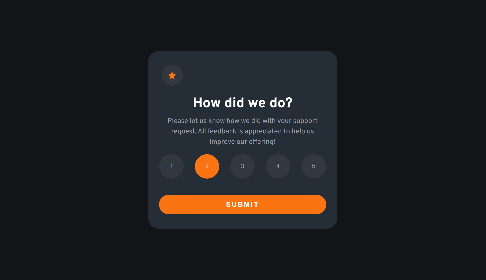
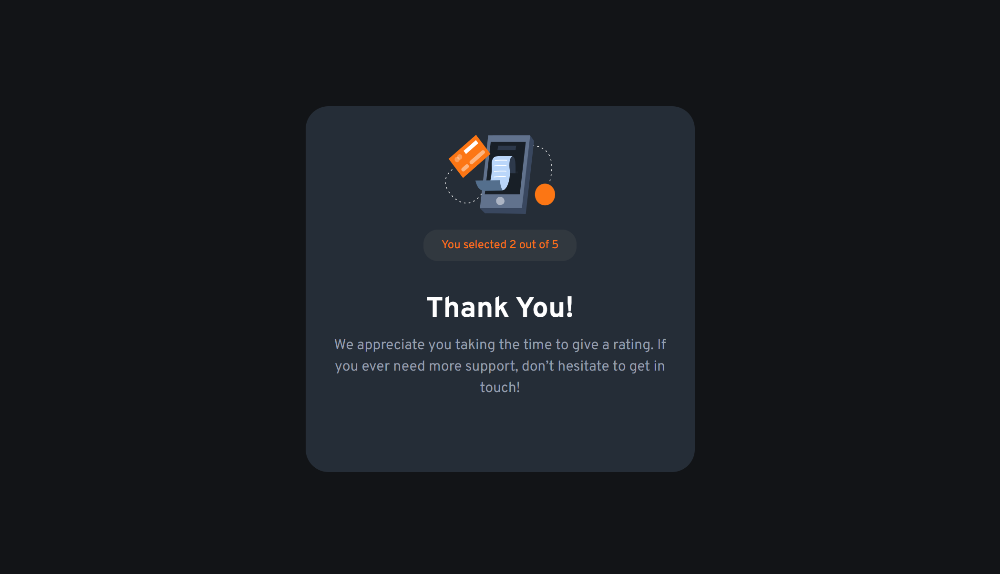

# Frontend Mentor - Interactive Rating App Solution with React

Thanks for checking out this front-end coding solution. This is a solution to the [Advice generator app challenge on Frontend Mentor](https://www.frontendmentor.io/challenges/advice-generator-app-QdUG-13db). This project was bootstrapped with [Create React App](https://github.com/facebook/create-react-app).

## Table of contents

  - [The challenge](#the-challenge)
  - [Screenshot](#screenshot)
  - [Links](#links)
  - [What I learned](#what-i-learned)
  - [Author](#author)

### The challenge

Users should be able to:

- View the optimal layout for the app depending on users' device's screen size
- See hover states for all interactive elements on the page
- Users should be able to rate the app and their rate should be displayed

### Screenshot

### Links

- Solution URL: [Click here](https://www.frontendmentor.io/challenges/interactive-rating-component-koxpeBUmI/hub)
- Live Site URL: [Click here](https://ozlemxates.github.io/FrontendMentor-Interactive-Rating-Component-React/)

### What I learned

While developing this project, I had my first experience with using React and gained insights into various important concepts. Here are some key takeaways:

- Foundations of React and Component Structure
- Utilizing the useState Hook
- JSX and Rendering Components
- User Interaction and Event Handling
- Managing Images and Styling

During the project, I began to grasp React's foundational principles and its component-based architecture. I utilized the useState hook to dynamically manage and update component states, handling user input including ratings and feedback. Furthermore, I practiced event handling, responding to user interactions such as button clicks, and efficiently capturing user ratings and feedback submissions. Moreover, I honed my skills in presenting visual content, seamlessly integrating images into components, and proficiently managing styling using CSS. This project provided me with valuable experience in understanding React's capabilities and its role in building dynamic user interfaces.

### Author

- GitHub - [ozlemxates](https://github.com/ozlemxates)
- Frontend Mentor - [@ozlemxates](https://www.frontendmentor.io/profile/ozlemxates)

### Thank you for checking out! 🎉